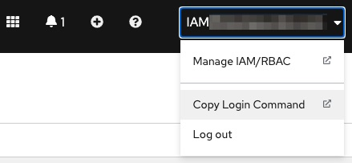
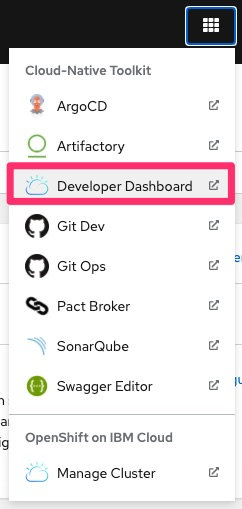
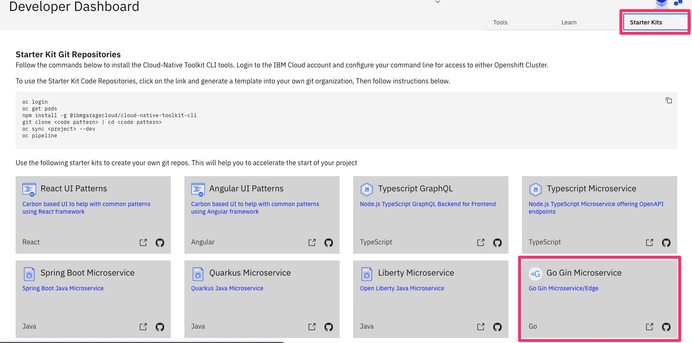

### HANDELING MOST OF THE TROUBLESHOOTING
- STEP 1: 
    - [Installing IBM Cloud Native Toolkit & Workshp and adding all oc policies.](https://github.com/therayy/Pipelining/blob/main/README.md)
- STEP 2:
    - Setup your terminal 
    ```
    curl -sL shell.cloudnativetoolkit.dev | bash - source ~/.bashrc || source ~/.zshrc
    
- STEP 3:
        <br>
        <p align="left">
          
        </p>
        <br>
- STEP 4: 
    - Set TOOLKIT_PROJECT environment variable If you are participation in a workshop replace projectdemo based on your assigned username (ex. project01).
    - ```
      TOOLKIT_PROJECT=projectdemo
    
    - ```
      oc sync $TOOLKIT_PROJECT-dev
      
- STEP 5: 
    - FORK and Clone the template git repo
    - Open your terminal and run that command to access the OpenShift web console 
        - ```
          oc console  
        - Then Access the 9 dots on the top right of the web console and choose Developer Dashboard as the following image: 
               <br>
                <p align="left">
                  
                </p>
                <br>
         - Select the Starter Kits and from that go select *GO GIN MICROSERVICE* and fork that repo.
                <br>
                <p align="left">
                  
                </p>
                <br>
- STEP 6:
    - RUN ```
          igc cerdentials 
    
        
